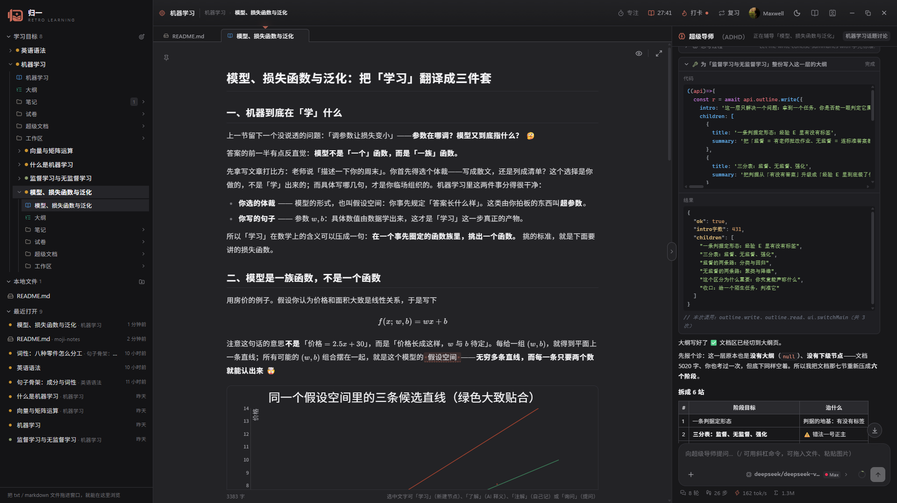

<div align="center">
  

# 归一 Unyra · 探索式学习

**本地优先的 AI 学习辅助桌面应用——从一个想弄懂的目标出发，把知识逐层拆成可探索的节点。**

[下载安装包](https://github.com/maplexrain/unyra/releases) · [项目文档](docs/README.md) · [问题反馈](https://github.com/maplexrain/unyra/issues)

[](https://github.com/maplexrain/unyra/actions/workflows/ci.yml)
[](https://github.com/maplexrain/unyra/releases)
[](https://github.com/maplexrain/unyra/releases)
[](https://www.electronjs.org/)
[](https://react.dev/)
[](https://www.typescriptlang.org/)

</div>

---

> **每个节点带一份教学文档与任意多份笔记**，由一位「超级导师」通过 JS 沙箱里的 api 直接改写来教学。
> 数据全部存在本机，模型请求由主进程直发你配置的服务商；默认接入 DeepSeek 官方，填一个 Key 就能用，
> 任何兼容 OpenAI / Anthropic / Responses 协议的服务都能接。

<p align="center">
  
</p>

## 目录

- [它解决什么问题](#它解决什么问题)
- [核心功能](#核心功能)
- [快速开始](#快速开始)
- [AI 提供商](#ai-提供商)
- [本地开发](#本地开发)
- [技术栈](#技术栈)
- [文档](#文档)
- [数据与隐私](#数据与隐私)

## 它解决什么问题

通用的聊天窗口里，学习是**线性**的：讲过的东西沉进上下文，几天后翻不回来，
也说不清自己到底掌握了哪一块。而归一把学习做成一张**图**：

- **知识是节点**，节点之间是**依赖边**（DAG），同一个概念可以被多个上层节点引用而不重复创建；
- **每个节点有自己的文档与笔记**，是能反复打开、原地改写的读物，而不是聊天记录里的一段回答；
- **导师在文档上动笔**，而不是只在对话框里说话——它写一段 JS 交给沙箱执行，教学正文、节点结构、
  试卷、注解都在这段代码里一次编排完；
- **学没学会被记下来**：自评、系统掌握的估计、反复犯的错、探针与考试的检验时间线，都在节点上。

于是「学过什么」「卡在哪儿」「下一步该学什么」这三件事，第一次有了可以翻回去看的地方。

## 核心功能

### 探索式学习

- **从目标开始**：输入一个想弄懂的问题，立刻建出根节点与目标上下文；导师随后给目标起标题、写描述，
  并给出一份可点击的系统性学习大纲。
- **选词建节点**：在文档里选中陌生概念，弹出菜单——「学习」在当前节点下创建子节点并自动开讲，
  「了解」在正文上划一条两三句的注解，「注解」写自己的 Markdown 批注，「询问」就选段向 AI 提问。
  每一项都带一个**数字键**，按 1~4 直接触发。
- **点击学习**：导师在文中用 `[概念](moji:learn "定位说明")` 布好下一步入口，已创建与未创建用不同样式区分。
- **复制的是源文**：预览里选中一段按 `Ctrl+C`，进剪贴板的是它在 Markdown 里的原文（公式、注解标记、
  视觉换行都不跟着走）。

### 超级导师

**一个学习目标一份上下文**：目标下所有节点共用同一段对话，切节点不换上下文，系统提示词稳定在目标一级，
前缀缓存因此不会因为切节点而整段作废。导师先思考、再写一段 JS 交给沙箱执行——讲解**直接写进教学文档**，
并在对话里说明改动理由。

- **思考可见**：思考气泡收起时露一行「最后一行」，持续往右滚，模型安静十几秒也看得出它还在写。
- **跟随与脱离**：输出时对话列表自动贴底；往上滚一下就脱离跟随，读上面的内容不会被反复拽回底部。
- **三种人格**：简洁导师（直奔主题）／标准导师（先直觉再原理，默认）／ADHD 导师（主线 + 支线，多用 emoji）。
  人格**不进系统提示词**，而是切换时补一条隐藏指令——换人格不重发历史、不作废前缀缓存。
- **上下文压缩**：导师写一份交接摘要（目标与背景 / 已讲清的结论 / 学习者的状态 / 约定与术语）
  与「还没做完的事」，此后原消息全部失活、只有摘要继续参与对话，原文一条都不删。
  可以手动触发，也可以在上下文用到 70%（可调）时自动压。
- **附件提问**：截图拖进或 `Ctrl+V` 粘进输入框，任意文本类文件从「更多 → 文件」挑；
  图片作为图像片段发给模型（只有声明了图像模态的模型才放行），文本读成正文拼进这一条消息。

### 文档与笔记

- **一个节点一份教学文档 + 任意多份笔记**，**一份笔记一个文件**，可以新建、改名、删除
  （「错题本」「摘录」各记一份，而不是全堆在一起）。
- **文档之间互相跳转**：`moji:doc/note`、跨节点 `moji:doc/#节点id/note`，**尾巴上还能带行号**——
  `#L12` 打开后滚到第 12 行并选中，`#L12-L20` 选一段，`#L12@切线斜率` 选中写的原文。
- **自由页签**：教学文档、任意一份笔记、任意一个本地文件平级排在一起；可拖动排序、可右键批量关闭、
  **没保存的页签关闭键会变成一颗圆点**。打开的页签与暂存区都记在 `state.json` 里，重启还在。
- **文档区可以分割**：把页签拖到另一格就是加入那一格，拖到某一格的边上就在那一侧拆出新的一格
  （左右贴边并排、上下贴边叠放），分割线可拖着调比例。
- **源码 / 预览**：源码视图里文档可直接编辑，改动先进**暂存区**（底栏显示字数与「已保存 / 未保存」），
  按 `Ctrl+S` 才写进文档——教学文档与笔记进学习数据，本地文件写回原文件。
- **读到哪儿了会被记住**：预览与源码各记一份，重开应用回到原来那一段。
- **查找与替换**：`Ctrl+F` 查找、`Ctrl+H` 替换；预览用 CSS Custom Highlight API 上色，
  一个 DOM 节点都不改。
- **导出**：`Ctrl+E` 出 Markdown 源文件 / 单文件 HTML / PDF 三种格式，公式走浏览器原生 MathML、
  零字体依赖。

### 考试与学习状态

- **考试**：按知识点出卷，作答在**独立的考试窗口**里进行（全屏、主窗口遮黑、切屏有记录）；
  客观题本地判分、主观题 AI 判分，再由导师**看着历次错题**写一份针对薄弱项的错题讲解。
  卷面是一份文档而不是一堆卡片。一份卷子可以**反复考**，历次成绩天然是一组。
- **主动回忆**：读完之后点「回忆」，导师合上文档请学习者用自己的话讲一遍，再给出
  「讲到了 / 漏了 / 说错了」三样并当场纠正——说错的地方直接进错误记忆。
- **学习状态**：自评（掌握 / 了解但不熟 / 不会 / 不确定）、系统估计的掌握度、错误记忆
  （同一个错法再犯只累加次数）与探针 / 考试 / 回忆的检验时间线。导师每次动笔前都读得到它。
- **有效阅读与打卡**：只有「窗口在前台 + 页签在主位 + 没静坐超过 60 秒 + 看的是教学文档」的时间
  才计入有效时长；打卡的题目只能出自**今天在这个目标下真正读到的节**——刷时长的人答不出题，
  想纯签到的人没有题可出。番茄钟是一个纯计时器，只停不暂停，只有跑完的专注段才记一笔。

### 界面与效率

- **资源管理器侧栏**：一棵知识树，一个节点底下挂着它的下级节点、笔记、试卷（可展开历次考试）
  与超级文档；每一行**右键**都有它那一类东西的动作。节点标题前那颗小点就是学习状态。
- **省着用的竖向空间**：顶栏一行里放着目标、面包屑与右端那一簇入口，其下整条让给页签。
- **两栏可以换边**：双击两栏中间那条分隔线即换位置；右侧栏可以整格收起；宽度记忆在用户设置里。
- **长对话里找回自己说过的话**：导师栏右边那排小点是消息定位条，悬停先看 70 字预览，
  点一下直接跳过去。
- **界面语言**：中文 / English 即时切换（登录页右上角或「设置 → 外观」），语言跟机器走，所有用户共用。
- **语音输入**：输入框右侧那颗话筒（「设置 → 插件 → 功能性插件 → 语音输入」里打开，默认关）。
  点一下开始录、说完按空格结束，识别的字落到光标处；引擎是 SenseVoiceSmall，模型 228 MB 在那一页下载。
  音频不出本机、也不写盘。
- **快捷键可以改**：默认六条（保存 / 查找 / 替换 / 导出 / 关闭页签 / 收起右栏），
  点「改键」按一下组合就换上了，冲突当场拦下。
- **教学模式（录屏用）**：打开「显示按键浮层」，左下角常驻一块小窗实时显示你按下的键。
- **主题**：跟随系统与十三套配色（浅色 / 深色 / 暖纸 / 琥珀 / 樱花粉 / …），任何界面都跟着走；
  代码块高亮颜色也跟着主题走。

### 文档能画图、能算、能跑代码

- **函数图像**：用 ` ```plot ` 围栏画函数曲线，公式用 LaTeX 写。
- **真正的代码高亮**：```js 这类围栏走 VS Code 那套 TextMate 语法（40 门语言，按需下载、结果缓存）。
- **代码块能编译运行**：鼠标经过代码块浮出「复制 / 编译 / 运行」——「编译」请超级导师把这段代码
  （残缺片段它会先去读**它所在的那篇文档**）转译成可执行的 JS，之后「运行」在一次性沙箱里跑，
  输出贴在代码块下面，联网要每次运行点一次头。
- **语法与渲染都是插件**：` ```plot ` 就是注册表里的一个插件，自己装的插件（`{root}/plugins/*.js`）
  走同一套接口——认领一种围栏语言、给出 HTML，需要画图的再补一个 DOM 挂载钩子；
  也可以只写「正文文字规则」，给全篇的引号、符号换样式。

## 快速开始

到 [发布页](https://github.com/maplexrain/unyra/releases) 下载最新的安装包：

| 文件 | 说明 |
| --- | --- |
| `Unyra-<版本>-Setup.exe` | 安装向导：可改安装目录、装进当前用户（不弹 UAC）、建桌面与开始菜单快捷方式 |
| `win-unpacked.zip` | 免安装的整份程序，解压后双击 `归一 Unyra.exe` 即可运行 |

装好之后：**选一个本机用户进入 → 顶栏齿轮里填 API Key → 新建一个学习目标**。

> 平台：目前只有 Windows 的安装包这一条链路（macOS / Linux 需要自行从源码构建）。

## AI 提供商

任何兼容 OpenAI 协议的服务都能接入（`POST /chat/completions` + `GET /models`，Bearer 鉴权，
SSE 流式，function calling）。**默认使用 DeepSeek 官方**，开箱即填一个 Key 就能用。

| 提供商 | 默认地址 |
| --- | --- |
| **DeepSeek 官方**（默认） | `api.deepseek.com` |
| 月之暗面 Kimi | `api.moonshot.cn/v1` |
| 智谱 GLM | `open.bigmodel.cn/api/paas/v4` |
| 阿里云百炼（通义千问） | `dashscope.aliyuncs.com/compatible-mode/v1` |
| 火山方舟（豆包） | `ark.cn-beijing.volces.com/api/v3` |
| 硅基流动 SiliconFlow | `api.siliconflow.cn/v1` |
| OpenRouter · OpenAI · Google Gemini · xAI Grok | 各自的官方地址 |
| Command Code Go 套餐 | `api.commandcode.ai`（私有网关） |

以上都是**内置提供商**：开箱即在列表里，选中后填 Key、勾模型即可用。此外可以加**自定义提供商**
接中转、公司内网、本地 Ollama / vLLM——选一种兼容格式（OpenAI / Anthropic / Responses）再填地址即可。

少数服务禁止浏览器直连（CORS 与请求头限制），本项目由**主进程**转发请求，因此都能用：
详见[主进程为什么转发 AI 请求](docs/architecture.md#为什么-ai-请求要经主进程)。

## 本地开发

```bash
npm install
node node_modules/electron/install.js   # 下载 Electron 二进制（Electron 44 起不再随 npm install 下载）
npm run dev                             # 起 Vite + Electron（改渲染层走 HMR，改 electron/ 自动重建重启）
npm run test                            # 一次跑完全部测试（提交前跑这个）
npm run build                           # 类型检查 + 渲染层构建 + 主进程编译
npm run lint
```

> 国内网络若卡在 GitHub，先设镜像再装 Electron：
> `$env:ELECTRON_MIRROR="https://cdn.npmmirror.com/binaries/electron/"`（PowerShell）。

想改点什么：应用的**扩展点**（内置一家服务商、加一门语言、加一种文档语法、加一个沙箱 api）
逐条写在[扩展方式](docs/architecture.md#扩展方式)里；打包与发布见
[打包与发布](docs/packaging-and-release.md)。

## 技术栈

Electron · React 19 · TypeScript · Vite · Tailwind CSS 4 · anime.js · KaTeX · marked ·
function-plot · vscode-textmate + oniguruma（按需加载的 TextMate 语法高亮）·
多提供商 AI 接入（流式对话 + 工具调用）· electron-updater（GitHub Releases 自动更新）

## 文档

这份 README 只负责介绍项目。**实现细节、设计取舍与踩过的坑都在 [`docs/`](docs/README.md) 里**：

| 文档 | 讲什么 |
| --- | --- |
| [docs/README.md](docs/README.md) | 文档目录：从哪一份开始读 |
| [探索式学习](docs/learning.md) | 目标 / 节点 / 大纲、选词菜单、注解、目标级对话 |
| [超级导师](docs/agent.md) | 人格、上下文压缩、工具气泡、Agent 设置、用户画像 |
| [沙箱 api](docs/sandbox-api.md) | 唯一那个 `execute` 工具、path 寻址、全部 api 一览 |
| [文档区](docs/workspace.md) | 自由页签、分割、源码 / 预览、暂存区、查找替换、导出 |
| [文档渲染与插件](docs/rendering.md) | 插件接口与边界、正文文字规则、代码块高亮 |
| [代码块的编译与运行](docs/code-run.md) | 伪编译工作流、运行沙箱、产物寻址 |
| [考试](docs/exam.md) · [学习状态与回忆](docs/learning-state.md) | 试卷与考试窗口、掌握度、错误记忆、探针 |
| [有效阅读与打卡](docs/reading-and-checkin.md) | 有效时长口径、节锚定、注意力评级、番茄钟、读网页 |
| [快捷键与语音](docs/shortcuts-and-voice.md) | 改键与冲突拦截、whisper.cpp + WebGPU 语音输入 |
| [桌面架构](docs/architecture.md) | 主进程与渲染层、窗口与原生能力、模块地图、扩展方式 |
| [AI 提供商](docs/ai-providers.md) | 预设与兼容格式、配置结构、思考程度、Command Code Go |
| [本地开发](docs/development.md) | 开发环境、脚本、测试分工与约定 |
| [打包与发布](docs/packaging-and-release.md) | 构建产物、反篡改、自动更新与发布流程 |
| [数据与隐私](docs/data-and-privacy.md) | 磁盘结构、迁移、外发请求的边界 |
| [有效阅读机制](docs/reading-mechanism.md) | 阅读采集的数据形状与落盘细节 |

## 数据与隐私

**所有数据都保存在本机的用户数据目录里，不上传任何服务器。**

```
{root}/users/{uid}/
├─ user.yaml            用户信息（画像）
├─ setting.yaml         外观、快捷键、AI 提供商与模型、agent 设置
├─ state.json           界面状态（当前目标 / 节点 / 打开的页签 / 没保存的暂存）
├─ docs/{目标}/         教学文档、笔记、对话、试卷、阅读与打卡账
└─ web/                 导师抓回来的网页正文
```

目录名就是标题，`.md` 是干净的正文（不含任何元数据语法），**可以脱离应用直接读、改、备份**。
`{root}` 默认是 `%APPDATA%\unyra`（v0.4.9 前是 `%APPDATA%\moji-notes`，升级后第一次启动会自动把整份数据搬过来），可在「设置 → 存储」改到任意位置：换目录即换一整套数据。

AI 请求由**主进程**直接发往你配置的服务商（默认 `api.deepseek.com`），不经过任何中间服务；
主进程只转发白名单内的主机，白名单来自内置预设与你实际配置过的地址。
完整的磁盘结构与迁移规则见[数据与隐私](docs/data-and-privacy.md)。

## 反馈

遇到问题或想要新功能，欢迎[提一个 Issue](https://github.com/maplexrain/moji-notes/issues)；
报 bug 时请带上版本号（「设置 → 关于」里能查到）与复现步骤。

## 写在最后

归一是一个人做的项目：代码、文档、安装包、答疑，基本都是我自己在弄。做这个东西不怎么赚钱，
我一直只是想把它认真做好。不过说实话，最近手头有点紧，光靠热情恐怕撑不了太久，所以还是
决定主动开口：如果你那边有合适的合作机会——外包、兼职开发、技术咨询，或者想基于归一做点
自己的东西——都欢迎加我聊聊，具体形式好商量，不介意从小事开始。

- 作者 QQ：2652079974
- 作者B站：[岚中古桥](https://space.bilibili.com/234503788)
- 归一交流群：851412626（使用中遇到问题也欢迎直接在群里问）
